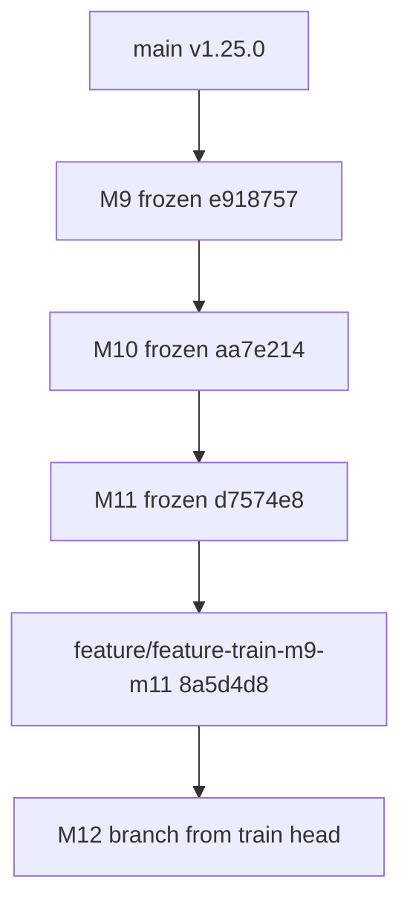
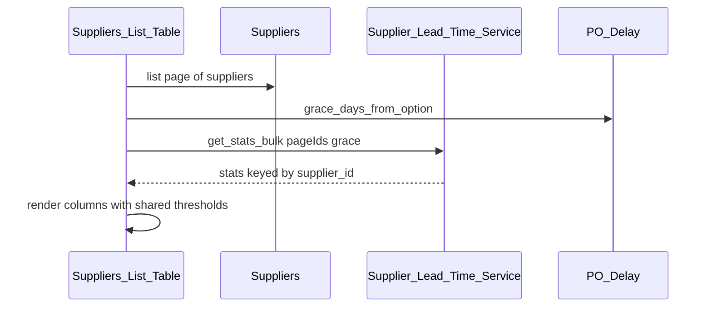

# Milestone M12 Implementation Plan — Supplier List Performance Surface

**Status:** Approved. This document is the immutable implementation specification for Milestone M12, materialized from the approved plan before any implementation code was written, per `docs/process/milestone-lifecycle.md` WP0 step 5 / Permanent Repository Rule 1. Once committed, this file is never edited, replaced, or repurposed — any future freeze/readiness record belongs in `docs/checklists/m12-release-readiness.md`, not here.

## Materialization note

Materialized verbatim from the approved Plan-mode document after pre-flight verification on `feature/feature-train-m9-m11` at `8a5d4d82e2573c9c1ad53d3c5dbeec25e23eac59` (plugin `1.28.0`, `DB_VERSION` `10`, CI recovery in ancestry, frozen M9/M10/M11 tips unchanged). No design amendments at materialization time.

# M12 — Supplier List Performance Surface (Definitive Plan)

## PART A — Verified repository state

| Check | Result |
|-------|--------|
| Path | `/opt/biopentra/dev/wc-inventory-overview` |
| Branch | `feature/feature-train-m9-m11` |
| HEAD | `8a5d4d82e2573c9c1ad53d3c5dbeec25e23eac59` (matches canonical base) |
| Sync | Matches `origin/feature/feature-train-m9-m11`; working tree clean |
| Plugin | `1.28.0` |
| `DB_VERSION` | `10` |
| Last release | `v1.25.0` |
| Frozen tips | M9 `e918757`, M10 `aa7e214`, M11 `d7574e8` — unchanged |
| Required checklists / lifecycle docs | Present |
| CI baseline | `failOnRisky=true`; no `continue-on-error` on gates; `checkout@v7` / `cache@v6`; recovery + draft PR #11 green |
| `docs/milestones/m12-implementation-plan.md` | Does **not** exist yet (correct for Plan mode) |

No material mismatch. Proceed.



---

## PART B — Discovery findings

### Product capability

| Finding | Classification |
|---------|----------------|
| Admin guide **Not Yet Available**: spend analysis, order-history reporting, supplier merge | product |
| M9/M11 explicitly deferred **list-table surfacing** of observed LT / on-time as “natural, low-risk follow-on” | product |
| M9→M10→M11 trio complete on **detail** screen; comparison / prioritization still requires opening each supplier | product / workflow |
| Suggestion `source` computed but not shown on new-PO form | product (tiny) |
| Position incoming drilldown lacks supplier | product (small adjacent) |
| Coverage/Forecast, Reservations, Inbound Shipment, printable PO, ASN/barcode, warehouse locations, storefront ED confidence from observed LT | architecture-reserved / future large |

### Architecture / maintenance / docs / release

| Finding | Classification |
|---------|----------------|
| Zero literal `TODO`/`FIXME` in code; deferrals live in plans/docs | process |
| `wc_io_po_delay_grace_days` is read everywhere but **never written by Settings UI** (docs imply Settings) | maintenance / docs inaccuracy — not M12 |
| `Plugin` god-class split, PHPCS baseline, README/CHANGELOG staleness for unreleased train | maintenance / release-prep |
| Feature-train docs intentionally leave “close now vs continue” to operator judgment | release/process |
| CI recovery incorporated; green baseline is a hard gate | testing / process |

### Workflow review (Phase 2)

```
Supplier detail: stats YES
Supplier list:   stats NO   ← decision-point gap for "who should I buy from?"
PO create:       silent expected-date suggest YES; performance context NO
GR / Position / Storefront: no M9–M11 consumer gaps blocking ops
```

Existing trustworthy data (`Supplier_Lead_Time_Service::get_stats_bulk`) already answers comparison; it is simply not shown where operators scan suppliers.

---

## PART C — M12 candidates

| Candidate | Value | Fit to M9–M11 | Size | Risk | Schema | Train fit | Verdict |
|-----------|-------|---------------|------|------|--------|-----------|---------|
| **Suppliers list performance columns** (observed avg + on-time %) | High for prioritization | Direct named follow-on | Small | Low | None | Completes performance story | **Selected** |
| Spend analysis | Medium–high | Adjacent analytics, different data | Medium–large | Med | Prefer none | New reporting unit | Defer (own milestone later) |
| Order-history reporting / drill-down | Medium | Complements stats | Medium | Low–med | None | Separate screen design | Defer |
| Suggestion `source` transparency | Low–med | M10 polish | Tiny | Low | None | Too small alone | Reject as milestone |
| Grace-days Settings writer | Ops hygiene | Not M9–M11 narrative | Tiny | Low | None | Maintenance | Reject as milestone |
| Position drilldown supplier | Useful | Weak M9–M11 link | Small | Low | None | Unrelated subsystem polish | Reject for this train |
| Supplier merge | Hygiene | Unrelated | Medium | **High** mutation | None | Needs Level B | Reject |
| ED confidence from observed LT | Medium | Downstream | Medium | **High** storefront | None | Needs usage + audit | Reject |
| Coverage/Forecast | High long-term | Blocked (sales velocity) | Very large | High | Likely | Wrong train | Reject |
| Printable PO | Medium | Unrelated | Small–med | Low | None | Different product unit | Defer |
| Close train with **no** M12 | — | M9–M11 already coherent | — | — | — | Valid, but leaves named follow-on unfinished | Rejected: list surface is the deferred slice of the *same* capability, not invented work |

---

## PART D — Recommended M12

**M12: Supplier List Performance Surface** — add read-only **Observed Lead Time** and **On-Time Rate** columns to [`includes/class-wc-inventory-overview-suppliers-list-table.php`](includes/class-wc-inventory-overview-suppliers-list-table.php), populated by one `Supplier_Lead_Time_Service::get_stats_bulk()` call for the current page’s supplier IDs.

Why this is M12 (not “end the train with nothing”):

1. Named twice as the intentional next slice after keeping M9/M11 detail-only.
2. Completes the operator question M11 discovery posed (“which suppliers should I trust/prioritize”) at the **comparison** decision point.
3. Zero new computation ownership — presentation-only reuse of existing bulk API and display thresholds.
4. Bounded, testable, Level A — natural last mile of the performance feature train before release.

---

## PART E — Definitive implementation plan

### 1. Executive summary

M12 surfaces M9/M11 supplier performance statistics on the Suppliers **list table** so merchants can compare suppliers without opening each detail screen. One bulk stats query per page load; same display thresholds and formatting policies as the detail panel; no schema, mutation, public API, or storefront change. Development version **1.29.0**; `DB_VERSION` remains **10**.

### 2. Discovery findings

See Part B.

### 3. Problem statement

Observed Lead Time and On-Time Delivery Rate exist only on the supplier edit screen. Choosing among suppliers still requires serial navigation. The bulk computation path already exists and is performance-proven; the list UI does not call it.

### 4. Why this capability is M12

See Part D. It is the smallest complete remaining slice of the M9–M11 performance narrative, not a new analytics subsystem.

### 5. Goals

- On Purchasing → Suppliers list, show per-row:
  - **Observed Lead Time**: rounded average days when `sample_count >= MINIMUM_SAMPLE_COUNT_FOR_DISPLAY` and `has_data`; otherwise an em dash / short “not enough data” affordance consistent with list-density (not the full detail prose).
  - **On-Time Rate**: rounded percentage when `is_on_time_rate_usable( $stats )`; otherwise em dash / not-enough-data affordance.
- Fetch stats once per `prepare_items()` via `get_stats_bulk( $page_ids, PO_Delay::grace_days_from_option() )`.
- Keep configured lead-time column as today.
- Extend the Lead Time Service caller allowlist deliberately to include the list-table class file.
- Add tests to the blocking CI filter from day one.

### 6. Non-goals

1. Spend analysis; order-history reporting; supplier merge.
2. Sortable observed/on-time columns (page-local sort would mislead; SQL sort would duplicate aggregate ownership).
3. Fastest/slowest/sample-count columns (detail screen retains full detail).
4. New grace-days setting or Settings UI for `wc_io_po_delay_grace_days` (maintenance; out of scope).
5. Suggestion `source` transparency; PO-create picker badges; Position drilldown supplier.
6. Storefront / REST / public API promotion of `Supplier_Lead_Time_Service`.
7. Any change to stats formulas, thresholds, or `Expected_Deadline` / `PO_Delay` behavior.
8. README/CHANGELOG train-wide staleness cleanup beyond M12’s own version/docs (defer to WP6 release prep).

### 7. Current architecture

- Stats owner: [`WC_Inventory_Overview_Supplier_Lead_Time_Service`](includes/class-wc-inventory-overview-supplier-lead-time-service.php) — `get_stats_bulk()`, `is_on_time_rate_usable()`, `MINIMUM_SAMPLE_COUNT_FOR_DISPLAY`.
- Grace days: `WC_Inventory_Overview_PO_Delay::grace_days_from_option()`.
- Detail presentation: [`Purchasing_Page::render_observed_lead_time()`](includes/class-wc-inventory-overview-purchasing-page.php).
- List presentation today: [`Suppliers_List_Table`](includes/class-wc-inventory-overview-suppliers-list-table.php) — columns name / currency / configured lead time only.
- Guard: [`test-supplier-lead-time-architecture.php`](tests/unit/supplier-lead-time/test-supplier-lead-time-architecture.php) `approved_callers()` = Purchasing Page + Expected_Date_Suggestion_Service.

### 8. Ownership model

| Responsibility | Owner |
|----------------|-------|
| Business rules (qualifying orders, on-time definition, thresholds) | Existing `Supplier_Lead_Time_Service` / `Expected_Deadline` / `PO_Delay` — **unchanged** |
| Read of stats for list page | `Suppliers_List_Table` calls `get_stats_bulk` (new approved caller) |
| Mutation | None |
| Presentation (list columns) | `Suppliers_List_Table` |
| Presentation (detail) | `Purchasing_Page` — unchanged |

No new domain owner. No new service class unless a tiny private formatting helper is needed inside the list-table file (prefer inline/private methods on the list table to avoid a new ownership surface).

### 9. Domain / data flow



### 10. Exact business rules

- Same qualifying-order and on-time rules as M9/M11 (no redefinition).
- Observed column shown when `has_data && sample_count >= MINIMUM_SAMPLE_COUNT_FOR_DISPLAY`; value = `(int) round( average_days )` + “days”.
- On-time column shown when `is_on_time_rate_usable( $stats )`; value = `(int) round( on_time_count / rated_order_count * 100 )` + `%`.
- Below threshold: display `—` (list-dense). Optional title/tooltip with short reason is allowed; do not paste full detail-panel paragraphs into cells.
- Archived-supplier lists (if shown via status filter) still show stats — same as detail.
- Empty page / no IDs: do not call bulk with junk; no query or empty-array call only.

### 11. New invariants

- **INV-M12-1:** Suppliers list table must never compute observed lead time or on-time rate itself (no `DATEDIFF`, no deadline SQL, no direct PO/GR queries for these columns). Only `Supplier_Lead_Time_Service::` may supply the figures.
- **INV-M12-2:** One `get_stats_bulk` invocation per `prepare_items()` for the current page’s IDs (no per-row `get_stats_for_supplier`).

### 12–13. Schema / DB_VERSION

**No schema change. `DB_VERSION` stays `10`.**

### 14. Development-version target

**1.29.0** (header + `WC_INVENTORY_OVERVIEW_VERSION` + `readme.txt` Stable tag). Not tagged/released in M12.

### 15. Public API impact

None. Service remains Internal. No `API_VERSION` promotion.

### 16. Security / capability impact

None. Same `manage_woocommerce` / Purchasing page capability as today’s list.

### 17. Admin / UI behavior

- New columns after configured lead time (order: Name | Currency | Lead Time (configured) | Observed Lead Time | On-Time Rate).
- Not sortable.
- Screen-options / column registration follows existing `WP_List_Table` patterns already used by this class.
- No AJAX.

### 18–19. Files affected / new files

**Modify**

- [`includes/class-wc-inventory-overview-suppliers-list-table.php`](includes/class-wc-inventory-overview-suppliers-list-table.php)
- [`tests/unit/supplier-lead-time/test-supplier-lead-time-architecture.php`](tests/unit/supplier-lead-time/test-supplier-lead-time-architecture.php) — allowlist + INV guards
- New tests under `tests/unit/suppliers/` and/or `tests/integration/suppliers/` (list-table rendering / bulk call)
- Extend performance coverage (reuse or extend supplier-lead-time performance suite) asserting one stats query for a page of N suppliers when preparing the list
- [`tests/docker/run-phpunit.sh`](tests/docker/run-phpunit.sh) — ensure filter discovers new classes (prefer `Test_WC_IO_Suppliers_` which already matches)
- Docs: admin-guide, ARCHITECTURE_BASELINE / architecture-audit M12 section, CLAUDE.md status row, release-runbook / validation-checklist M12 subsections, rollback-plan entry, testing.md counts as needed
- Version bump files for 1.29.0; CHANGELOG entry for unreleased 1.29.0

**New production classes:** none required.

### 20. Hooks / integration points

None new. No filters/actions required for v1.

### 21. Query / performance contract

- Preparing a suppliers list page of size P issues **exactly one** `Supplier_Lead_Time_Service` SQL query (via `get_stats_bulk`), independent of P within the same scale bands already used (10/40/200).
- No N+1. Guarded by performance test + INV-M12-2.

### 22. Backward compatibility

- Detail panel, M10 suggestions, PO delay, storefront ED unchanged.
- List gains columns only; existing columns keep meaning.

### 23. Rollback strategy

Code-only; remove/revert list columns. No data migration. Safe rollback like M9–M11.

### 24. Work packages

| WP | Work | Depends |
|----|------|---------|
| **WP-M12-0** | Branch from `feature/feature-train-m9-m11` @ `8a5d4d8`; materialize this plan into `docs/milestones/m12-implementation-plan.md`; commit **that file alone**; treat as immutable | — |
| **WP-M12-1** | List-table columns + `prepare_items` bulk fetch + rendering rules | WP-M12-0 |
| **WP-M12-2** | Architecture allowlist + INV-M12-1/2 guards | WP-M12-1 |
| **WP-M12-3** | Unit/integration tests (thresholds, empty, archived filter, no duplicate computation) | WP-M12-1 |
| **WP-M12-4** | Performance: one stats query for list prepare at 10/40/200 | WP-M12-1 |
| **WP-M12-5** | Docs (admin-guide Available Now; remove list-table from deferred narrative; baseline/audit/CLAUDE/runbook/validation/rollback) | WP-M12-1 |
| **WP-M12-6** | Version 1.29.0 + CHANGELOG; CI green rehearsal (unit + M1–M12 focused + integration + `release-audit --development`); Level A freeze record `docs/checklists/m12-release-readiness.md` | WP-M12-2…5 |

### 25–28. Test plan

**Unit**

- Architecture: allowlist includes `class-wc-inventory-overview-suppliers-list-table.php`; list-table source has no `DATEDIFF` / deadline SQL / direct PO-GR stats queries.
- Pure rendering helpers if extracted (threshold → cell string).

**Integration**

- Seed suppliers with 0 / 1 / ≥2 completed orders and known/unknown expected dates; assert list cell text for observed and on-time matches detail policy.
- Regression: configured lead-time column unchanged; M9/M11 detail panel still correct.

**Architecture guards**

- Extend existing Lead Time architecture test; add INV-M12-1/2 assertions.

**Performance**

- Hook list `prepare_items` (or equivalent integration driver) at 10/40/200 suppliers; assert single stats query count equality / absolute one query for the stats path.

**Manual**

- Browser: Suppliers list shows columns; open detail and confirm same supplier’s figures agree when above threshold.

### 29–30. Regression requirements

- Full unit, M1–M12 focused (default filter), integration suites green.
- Explicit: M9 fields, M10 suggestions, M11 on-time detail, PO Delay suite unmodified pass.

### 31. Documentation deliverables

Admin guide (list columns; still leave spend/history/merge as Not Yet Available); baseline + audit M12 section; CLAUDE status; runbook/validation/rollback; feature-train head checklist update after freeze; **no** `GITHUB_RELEASE_NOTES_1.29.0.md` until WP6.

### 32. Acceptance criteria

- List shows Observed Lead Time + On-Time Rate with correct thresholds.
- One `get_stats_bulk` per page prepare.
- Allowlist updated; INV-M12-1/2 enforced.
- Version 1.29.0; DB_VERSION 10.
- All CI gates green (below).

### 33. Definition of Done

- All WPs complete; freeze checklist written; Level A review done; working tree clean; **not** merged to `main`, **not** tagged, **not** deployed.
- Plan file immutable after WP-M12-0.

### 34. Risks and mitigations

| Risk | Mitigation |
|------|------------|
| Duplicate computation in list table | INV-M12-1 source guard |
| N+1 via `get_stats_for_supplier` per row | INV-M12-2 + performance test |
| List cells disagree with detail | Shared threshold helpers / same service fields; integration parity cases |
| Scope creep into spend/history | Explicit non-goals |

### 35. Explicit deferred work

Spend analysis; order-history reporting; supplier merge; grace-days Settings UI; suggestion source transparency; Position supplier column; ED confidence from observed LT; printable PO; Coverage/Forecast; warehouse locations; PHPCS/`Plugin` split; train-wide README/CHANGELOG release packaging (WP6).

### 36. Commit strategy

Conventional commits per WP (`feat`/`test`/`docs`/`chore`); footer `Closes #LP-0`. No squash of WP-M12-0 plan commit.

### 37. Stop conditions

- Any desire to add spend/history/merge/schema/storefront → stop; new discovery.
- CI red under restored baseline → M12 incomplete.
- Formula change to on-time/lead-time → stop; out of scope.

### 38. Final implementation-report contract

Report must include: branch/SHA; files touched; test counts (unit / focused / integration) with 0 risky/fail/error; performance query proof; allowlist diff; confirmation frozen M9–M11 tips untouched; confirmation no schema/`DB_VERSION` change; Level A freeze path taken; train-closure recommendation reiterated (not executed).

### CI contract (hard)

From first test WP onward:

- unit green
- M1–M12 focused green (default `run-phpunit.sh` filter)
- integration green
- 0 risky / 0 failures / 0 errors
- `release-audit.sh --development` green
- GitHub Actions green on the M12 PR/check context

Known-red CI is not acceptable completion.

---

## PART F — Risk / lifecycle classification

**LEVEL A — Lightweight completion review + freeze.**

Justification: no schema/migration; no stock/cost or PO/receipt lifecycle mutation; no public API; no ownership reassignment in `OWNERSHIP.md`; no destructive ops; no capability/security change; no customer-facing behavior; no new transactions — presentation consumer of an existing Internal read service, same risk class as M10/M11 Level A.

---

## PART G — Feature-train recommendation

**B — After M12, close the feature train** and prepare one comprehensive train-level audit + bundled release of **M9 + M10 + M11 + M12** (versions 1.26.0–1.29.0 content under a single release decision), rather than continuing to M13 on this train.

Rationale:

- M12 completes the supplier **performance** product unit (detail + list compare + suggestion + on-time).
- Remaining backlog (spend, history, merge, Coverage, printable PO) starts **different** product units.
- Four unreleased milestones since `v1.25.0` is enough accumulated value; further growth delays merchant benefit.
- No release triggers inside M12 itself, but M12 creates a **natural coherence boundary** for WP6.

Do **not** execute release/tag/deploy in the M12 implementation session — only freeze M12 and record that WP6 is the next authorized process step.

---
