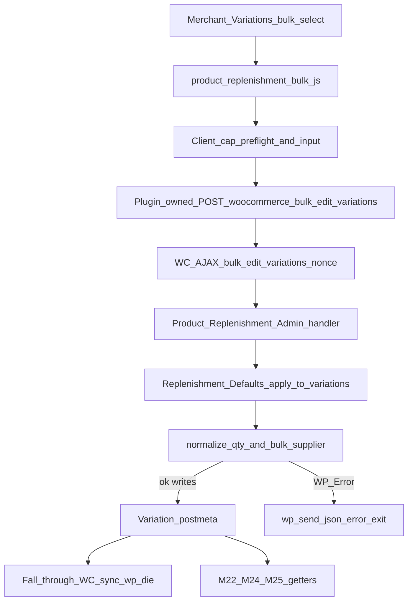

<!-- IMMUTABLE after first commit on feature/m26-apply-replenishment-defaults-to-variations.
     Do not edit this file. Implementation follows this specification. -->

# M26 Definitive Implementation Plan — Apply Replenishment Defaults to Variations

**Status:** APPROVE AFTER NARROW AMENDMENT incorporated (idempotent counters, validation-vs-write atomicity, full-path perf). Ready for implementation without another planning round unless architecture changes.

## 1. Executive verdict

**Ship M26 as a small Level A configuration-convenience milestone**, development/release **`1.43.0`**, **`DB_VERSION` remains 11**.

**UX:** extend WooCommerce’s existing variation bulk-action `<select>` (classic product editor) with four Replenishment actions that write ordinary independent M23 variation postmeta via `Replenishment_Defaults` — **COPY/APPLY NOW**, never inheritance.

**M27:** **not justified as a scheduled milestone**. After M26, the **currently planned replenishment roadmap is complete**; former M27 stays **unnumbered, evidence-gated backlog**.

**Do not start M27. Do not invent M28.**

---

## 2. Verified v1.42.0 baseline

| Check | Result |
|---|---|
| Repo | `/opt/biopentra/dev/wc-inventory-overview` |
| Tree | Clean |
| `main` / `origin/main` | `b603907c37242e66610a7abad9fcb98c5ae0689a` |
| Release merge / tag peel | `v1.42.0` → `9b7e2e83b832426296f3026334e223de403c43e0` |
| Plugin / DB | `1.42.0` / `DB_VERSION` `11` |
| M24+M25 | Released |
| M26/M27 branch/plan/code | **None** |
| Active roadmap text | [docs/milestones/m24-implementation-plan.md](docs/milestones/m24-implementation-plan.md) §4 |
| Superseded naming | M21’s “Sales-Velocity M26” is historical only — ignore |

**Implementation base SHA:** `b603907c37242e66610a7abad9fcb98c5ae0689a`

---

## 3. Existing M23 defaults architecture (frozen)

Sole owner: [`includes/class-wc-inventory-overview-replenishment-defaults.php`](includes/class-wc-inventory-overview-replenishment-defaults.php)

- Keys: `_wc_io_preferred_supplier_id`, `_wc_io_default_replenishment_qty`
- API today: `get_*`, `get_bulk`, `save_preferred_supplier(int,int)`, `save_default_qty(int,$raw)` — **no bulk writer**; **no extracted non-mutating validators yet** (M26 adds them)
- Eligibility: `Suppliers::is_eligible_for_selection()` only on **new** supplier choice; same-id stale resubmit is no-op (**single-item save path only** — see §11 bulk exception)
- Qty: blank/null clears; `<=0` / non-numeric → `WP_Error`; store via `wc_format_decimal(..., 4)`

Admin: [`includes/class-wc-inventory-overview-product-replenishment-admin.php`](includes/class-wc-inventory-overview-product-replenishment-admin.php) — hooks, `edit_product` cap, WC save nonces, field isolation, variation identity = variation post id.

Pre-existing smell (out of M26 scope): Inventory-tab fields can still render/save on a variable parent. M26 must **not** write parent meta. Optional backlog cleanup only — **not M27**, must not delay roadmap closure.

---

## 4. WooCommerce variation UX findings (installed WC 10.9.4)

| Seam | Reality |
|---|---|
| UI options | `woocommerce_variable_product_bulk_edit_actions` |
| AJAX entry | `WC_AJAX::bulk_edit_variations()` — nonce `bulk-edit-variations` |
| Plugin hook | `woocommerce_bulk_edit_variations( $bulk_action, $data, $product_id, $variations )` — **void; return value ignored** |
| Child set | All children (`posts_per_page => -1`); **WC imposes no variation-count cap** on bulk edit |
| Success termination | bare `wp_die()` after `WC_Product_Variable::sync` — **empty body** |
| WC JS success | always `go_to_page(1)` — **does not inspect response body / errors** |
| Modal precedent on same screen | `WCBackboneModal` used for set-price-variations; **async**, incompatible with sync `{action}_ajax_data` return |

**Decision:** reuse WC bulk-action UI + endpoint. Because WC has no error channel on this AJAX, M26 **owns the AJAX completion wrapper** for its four actions (see §5 and §18).

---

## 5–10. Selected M26 UX and contracts

### Selected UX — four bulk actions

| Action slug | Input UI (frozen) | Writes |
|---|---|---|
| `wc_io_variable_preferred_supplier` | **Plugin-owned modal** with `<select>` of active suppliers | Set supplier on **all** children |
| `wc_io_variable_preferred_supplier_clear` | `window.confirm` | Clear supplier on all children |
| `wc_io_variable_default_qty` | `window.prompt` (same pattern as WC “Set regular prices”) | Set qty on all children |
| `wc_io_variable_default_qty_clear` | `window.confirm` | Clear qty on all children |

### Frozen supplier-dialog architecture (Amendment 1)

**Not** a native `prompt()` pretending to be a `<select>`. **Not** left to the implementer.

**Mechanism:**

1. PHP prints a one-time product-edit template (hidden markup) containing:
   - title / help text
   - `<select id="wc_io_bulk_preferred_supplier">` options from the same active-supplier list M23 uses (`Suppliers::list` status ACTIVE, + “— None —” is **not** used here — Clear is a separate action)
   - Apply / Cancel buttons
2. CSS: simple overlay (plugin CSS on product screen only). **Do not** depend on `WCBackboneModal` for this flow (async; does not fit WC’s sync `_ajax_data` contract).
3. JS flow for **all four** M26 actions (frozen):
   - Listen on `select.variation_actions` via `{action}_ajax_data`.
   - **Client cap preflight:** read `$('#variable_product_options .woocommerce_variations').attr('data-total')`. If `> MAX_APPLY_VARIATIONS` (100): `window.alert` with the product-limitation message (see §19); return `null` (cancel WC default AJAX).
   - Gather input (open plugin modal and wait for Apply/Cancel via deferred callback pattern that **cancels WC AJAX first**, then fires plugin AJAX on Apply — see below).
   - **Always return `null` from `_ajax_data`** so WooCommerce’s built-in bulk AJAX (which ignores errors) does **not** run for M26 actions.
   - On confirmed input, plugin calls `wcIoReplenishmentBulk.request(bulk_action, data)` — same URL/action/nonce/product_id as WC, but **plugin-owned** `success` handler that understands `{ error: "…" }`.

Modal Apply/Cancel is therefore asynchronous **after** cancelling WC’s default request — this is intentional and frozen.

Qty Set may use blocking `window.prompt` inside `_ajax_data`, then still return `null` and fire `wcIoReplenishmentBulk.request` for consistent error handling.

### Copy vs inheritance

**COPY/APPLY NOW only.** No parent runtime fallback. No ongoing link. Independent per-variation edit afterward via existing M23 panels.

### Source-value contract

Values come from the bulk-action dialog/prompt for **that request only** — not parent meta, not a source variation, not Inventory-tab staging.

### Target-selection contract

Targets = WC-supplied full child list for `$product_id`. No custom checkbox matrix. One-off exceptions = per-variation panels.

### Overwrite contract

Set applies the chosen value to every target. Unaffected field never touched.

**Idempotent success (Amendment 9 — frozen):** applying a value a target **already stores** is successful idempotent behavior, **not** a `WP_Error`. WordPress `update_post_meta()` returning `false` when the new value equals the stored value must **not** be treated as failure.

### Clear/unset contract

Clear **only** via explicit Clear actions. Prompt cancel → no request. Never conflate don’t-touch with clear.

**Idempotent success (Amendment 9 — frozen):** clearing a key that is **already absent** is successful idempotent behavior, **not** a `WP_Error`. WordPress `delete_post_meta()` returning `false` when the key is missing must **not** be treated as failure.

### Field isolation

- Supplier-only Set/Clear → qty untouched (including preserving stale supplier on qty-only ops)
- Qty-only Set/Clear → supplier untouched

---

## 11–17. Validation, ownership, atomicity

### Single authoritative validation (Amendment 2) — frozen

**Do not** pre-validate quantity/supplier with a second copy of the rules and then call mutating `save_*`.

Extract **non-mutating** primitives **inside** `Replenishment_Defaults` (private or package-visible statics; not a new public plugin API):

```php
/**
 * @param string|int|float|null $raw
 * @return array{action:'clear'}|array{action:'set', value:string}|WP_Error
 *         value is wc_format_decimal(..., 4) string when action=set
 */
private static function normalize_default_qty( $raw )

/**
 * Bulk Set path only — requires currently eligible supplier (no stale same-id shortcut).
 * @param int $supplier_id
 * @return array{action:'clear'}|array{action:'set', supplier_id:int}|WP_Error
 */
private static function normalize_preferred_supplier_for_bulk_set( int $supplier_id )
```

Then:

- Refactor `save_default_qty()` to call `normalize_default_qty()` then mutate.
- Keep `save_preferred_supplier()` behavior **byte-compatible for single-item admin saves**, including **stale same-id no-op** (BR-M23-7).
- `apply_to_variations()` calls the **non-mutating** normalizers **once** up front; then per target uses thin private write helpers that treat already-equal / already-absent as success (Amendment 9). **One rule source; true validate-before-write.**

### Bulk Set supplier vs stale same-id (Amendment 3) — frozen

**Bulk Set intentionally requires a currently eligible supplier for every Set**, regardless of what any variation already stores.

- Does **not** apply M23’s stale same-id no-op shortcut on the bulk path.
- Rationale: bulk is an explicit “make all these variations use supplier X now” operator command; X must be selectable today.
- Archived/merged/missing → whole operation fails before any write.
- Clear actions still clear unconditionally (no eligibility needed).
- Qty-only bulk still **preserves** whatever supplier meta exists (including stale) — field isolation unchanged.
- Single-variation panel saves retain M23 stale no-op unchanged.
- **Distinct from Amendment 9:** bulk Set of eligible supplier A when a variation already has A is still success (idempotent equal-value), because A is eligible. Bulk Set of an archived id fails validation even if some variations already store that archived id.

### Validation atomicity vs write atomicity (Amendment 10 — frozen)

M26 guarantees **validation atomicity only**:

- Predictable validation failures (bad parent, over cap, foreign/simple/deleted id, ineligible supplier, invalid qty, missing capability on any target) → **zero writes**.

M26 does **not** guarantee **write atomicity**:

- No DB transaction / no compensating rollback of earlier variation meta.
- An unexpected database/meta failure after variation 37 may leave variations 1–36 already updated.
- Do **not** attempt rollback by restoring old metadata (would add a riskier mutation layer to a small configuration feature).

Never summarize “validate-before-mutate” as “all-or-nothing.”

### Unexpected mid-write failure payload (frozen)

On a true operational write failure (not idempotent false), return `WP_Error` whose `error_data` includes **all** of:

| Key | Meaning |
|---|---|
| `variations_updated` | Successfully processed before failure (incl. prior idempotent no-ops) |
| `supplier_updates` | Supplier ops completed before failure (incl. idempotent) |
| `qty_updates` | Qty ops completed before failure (incl. idempotent) |
| `failed_variation_id` | Variation post id that failed |
| `failed_field` | `preferred_supplier` \| `default_qty` |
| `failed_operation` | `set` \| `clear` |

UI surfaces the error message; counters are for tests/logging/readiness evidence.

### Mutation ownership + return contract (Amendments 7 + 9)

```php
/**
 * @param int   $parent_product_id
 * @param int[] $variation_ids
 * @param array $changes {
 *   @type bool                    $update_preferred_supplier
 *   @type int                     $preferred_supplier_id  // required if update; 0 = clear
 *   @type bool                    $update_default_qty
 *   @type string|int|float|null   $default_qty            // required if update; ''|null = clear
 * }
 * @return array{
 *   variations_updated:int,
 *   supplier_updates:int,
 *   qty_updates:int
 * }|WP_Error
 */
public static function apply_to_variations( int $parent_product_id, array $variation_ids, array $changes )
```

**Frozen counter semantics (successful-operation counts, NOT raw SQL-change counts):**

- `variations_updated` — number of target variations **successfully processed** for the requested operation(s), **including** idempotent already-equal / already-cleared no-ops.
- `supplier_updates` — number of targets for which the supplier operation successfully completed, **including** already-equal / already-cleared no-ops.
- `qty_updates` — equivalent for quantity.

**Examples:**

- 20 variations, Set both fields, all succeed (mix of real changes + already-equal) → `variations_updated=20`, `supplier_updates=20`, `qty_updates=20`.
- 10 variations already supplier A; Set supplier A → `variations_updated=10`, `supplier_updates=10`, `qty_updates=0` — **success**, not partial failure.
- Clear supplier where all already unset → `variations_updated=N`, `supplier_updates=N` — **success**.

Do **not** rename to `*_changed` unless a future product decision needs actual-DB-delta metrics; current names mean successful operation counts. Never use ambiguous key `updated`.

**Write-helper rule:** private bulk writers must treat “desired state already present” as success (`true`), never map WP `false` from equal-value `update_post_meta` / missing-key `delete_post_meta` to `WP_Error`.

Rules: omitted / `update_*=false` → don’t touch; never write parent; never `update_post_meta` outside this class for these keys.

---

## 18–21. Security, size, performance, AJAX errors

### AJAX error propagation (Amendment 5) — frozen

Inspected `WC_AJAX::bulk_edit_variations()` (WC 10.9.4): after `do_action( 'woocommerce_bulk_edit_variations', … )` it always `sync` + bare `wp_die()`. Action return values are ignored. Stock WC JS `success` always reloads page 1 and **never reads an error payload**.

**Therefore returning `WP_Error` from the hook does nothing visible.**

**Frozen mechanism:**

1. **Client preflight** for `data-total > 100` (and cancel/empty prompt) — alert, no AJAX.
2. M26 actions use **plugin-owned AJAX** to the same `woocommerce_bulk_edit_variations` endpoint (same nonce).
3. In the PHP hook handler, on failure **after** identifying our `$bulk_action`:
   ```php
   wp_send_json( array( 'error' => $wp_error->get_error_message() ) );
   // wp_send_json exits — skips WC sync/wp_die (no writes occurred if validate-before-write held)
   ```
4. On success: **fall through** (void return) so WC still runs `WC_Product_Variable::sync` + `wp_die()`.
5. Plugin JS `success`:
   ```js
   if ( response && response.error ) {
     window.alert( response.error );
     unblock();
     return;
   }
   // mirror WC: go_to_page(1)
   ```

Crafted-request / server-only failures remain visible via this channel. Do not rely on `WC_Admin_Meta_Boxes::add_error` for this AJAX path (that is for full page product saves).

### Security / nonce testing boundaries (Amendment 6)

| Layer | What it proves | How |
|---|---|---|
| Owner / service | validate-before-write, caps on ids, field isolation, bulk eligibility rule, return counts | Direct `apply_to_variations()` unit/integration tests — **no nonce** |
| Plugin hook handler | action slug gating, `$data` mapping, parent/variation auth checks, `wp_send_json` error exit | Invoke handler / `do_action( 'woocommerce_bulk_edit_variations', … )` with crafted args — **nonce not in scope here** |
| WC AJAX entry | `check_ajax_referer( 'bulk-edit-variations', 'security' )` protects the operation | Hit `admin-ajax.php?action=woocommerce_bulk_edit_variations` (or `WC_AJAX::bulk_edit_variations` under simulated `$_POST`) **with missing/bad nonce** and assert die/-1 / failure; with valid nonce + our action assert success path |

Do **not** claim an isolated `woocommerce_bulk_edit_variations` do_action invocation proves nonce rejection.

### Capability

`edit_product` on parent and each target (fail closed). WC entry also requires `edit_products`. No Purchasing_Caps. No new capability.

### Operation-size limit (Amendment 4) — frozen

`WC_Inventory_Overview_Replenishment_Defaults::MAX_APPLY_VARIATIONS = 100`

**WC bulk endpoint does not cap children** (`posts_per_page => -1`). M26’s 100 is an explicit product limit.

**Accepted product limitation:** variable products with **more than 100 variations cannot use M26 bulk-apply**; merchants must use per-variation M23 panels (or reduce variation count). This is intentional — not a silent truncate.

**UX before AJAX (mandatory):**

> “This product has {n} variations. Replenishment bulk apply supports at most 100 variations. Edit variation defaults individually, or reduce the number of variations.”

Server re-checks the same cap (defense in depth) and returns `{error:…}` if bypassed.

### Performance (Amendment 11 — frozen)

- Normalize/validate supplier and qty **once** per request
- No per-variation supplier `get()` after pre-check
- No M24/M25 planning queries
- Linear meta ops with target count are expected

**Measure the complete production bulk-apply path** (owner `apply_to_variations` as invoked in production, including the same membership + per-target `edit_product` checks the handler/owner perform), at **1 / 10 / 50 / 100**, for supplier-only and qty-only:

| Metric | Why |
|---|---|
| Wall time | Operator-facing latency |
| Total SQL queries | Catch accidental N+1 (capability/object loads, meta reads) separately from writes |
| Meta write/delete calls | Expected linear with targets × fields |
| Notes on cache warmth | Cold vs warm object-cache shape if materially different |

Do **not** invent a predeclared query ceiling. Record the measured shape in freeze evidence. An N+1 capability/read pattern is a finding to fix or consciously accept — not to hide inside a write-only count.

---

## 22–24. Downstream, schema, public API

- **Do not modify** Planning / Commit / Prefill / Position / PO services
- **No schema**; `DB_VERSION` 11
- **No new public hooks/filters/API** (private normalizers on the owner class are fine)

---

## 25. Exact production files / methods

| File | Change |
|---|---|
| [`includes/class-wc-inventory-overview-replenishment-defaults.php`](includes/class-wc-inventory-overview-replenishment-defaults.php) | `MAX_APPLY_VARIATIONS`; `normalize_default_qty`; `normalize_preferred_supplier_for_bulk_set`; refactor `save_default_qty`; `apply_to_variations` |
| [`includes/class-wc-inventory-overview-product-replenishment-admin.php`](includes/class-wc-inventory-overview-product-replenishment-admin.php) | Bulk UI options; hook handler with `wp_send_json` error exit; enqueue JS/CSS; print modal markup; localize suppliers + i18n + max |
| `assets/product-replenishment-bulk.js` (**new**) | Cap preflight; modal; confirm/prompt; cancel WC default AJAX; plugin-owned request + error alert |
| `assets/product-replenishment-bulk.css` (**new**, optional if inline minimal) | Modal overlay |
| Version / CHANGELOG / release notes | At freeze / release prep (`1.43.0`) |
| `docs/milestones/m26-implementation-plan.md` | **First documentation commit on the feature branch** (immutable thereafter) |



---

## 26. BR-M26 matrix (testable)

| ID | Rule |
|---|---|
| BR-M26-1 | Bulk apply only via explicit WC variation bulk action + plugin AJAX wrapper |
| BR-M26-2 | Targets are WC-supplied children of the edited variable parent |
| BR-M26-3 | Every target must belong to that parent; foreign/simple/deleted rejected before write |
| BR-M26-4 | Variable parent never receives either meta key from M26 |
| BR-M26-5 | Bulk Set supplier requires **currently eligible** supplier; archived/merged/missing fail entire op |
| BR-M26-6 | Qty Set uses `normalize_default_qty` (same rules as M23); zero/invalid rejected |
| BR-M26-7 | Supplier-only ops never change qty |
| BR-M26-8 | Qty-only ops never change supplier (including stale) |
| BR-M26-9 | Set applies the chosen value to every target; already-equal value is successful idempotent no-op (not WP_Error) |
| BR-M26-10 | Clear only via explicit Clear actions; already-absent key is successful idempotent no-op (not WP_Error) |
| BR-M26-11 | After apply, each variation remains independently editable via existing panels |
| BR-M26-12 | Qty-only apply preserves stale preferred supplier meta |
| BR-M26-13 | **Validation atomicity:** full validation precedes first mutation; predictable validation errors → zero writes |
| BR-M26-14 | `count(targets) > 100` rejected client-side and server-side with no writes |
| BR-M26-15 | Requires `edit_product` on parent and each target |
| BR-M26-16 | WC `bulk-edit-variations` nonce protects the AJAX entry (tested at that boundary) |
| BR-M26-17 | No PO / stock / cost mutation |
| BR-M26-18 | Downstream M22/M24/M25 consume applied defaults without code changes |
| BR-M26-19 | No ongoing inheritance after apply |
| BR-M26-20 | Clear deletes meta via owner (or no-ops if already absent) |
| BR-M26-21 | Bulk Set does **not** use M23 stale same-id no-op for ineligible ids; single-item `save_preferred_supplier` still does |
| BR-M26-22 | Server failures surface as `wp_send_json({error})` caught by plugin JS (not silent reload) |
| BR-M26-23 | Products with >100 variations are an explicit supported limitation (individual editing only) |
| BR-M26-24 | Counters are successful-operation counts including idempotent no-ops — never raw SQL-change counts; never treat equal-value/missing-delete `false` as failure |
| BR-M26-25 | **No write atomicity / no rollback:** unexpected mid-write failure may leave earlier variations updated; error_data reports processed counts + failing variation/field/operation |

---

## 27. INV-M26 matrix

| ID | Invariant |
|---|---|
| INV-M26-1 | `Replenishment_Defaults` remains sole writer of both meta key string literals |
| INV-M26-2 | No direct meta writes for those keys outside owner |
| INV-M26-3 | M26 path never persists defaults on variable parent |
| INV-M26-4 | No duplicated supplier-eligibility **definition** (still `is_eligible_for_selection`) |
| INV-M26-5 | Qty normalization lives in one primitive used by `save_default_qty` and bulk |
| INV-M26-6 | No production edits to M21/M24/M25 business logic |
| INV-M26-7 | `DB_VERSION === 11` |
| INV-M26-8 | No PO/stock/cost mutation |
| INV-M26-9 | No new public plugin hook/filter/API |
| INV-M26-10 | No background job |
| INV-M26-11 | Hard target bound 100; no silent truncate |
| INV-M26-12 | No hidden inheritance |
| INV-M26-13 | Field isolation |
| INV-M26-14 | Validation atomicity only (validate-before-mutate ≠ all-or-nothing write atomicity) |
| INV-M26-15 | Classic WC bulk seams; React redesign out of scope |
| INV-M26-16 | Return contract uses `variations_updated` / `supplier_updates` / `qty_updates` as successful-operation counts (incl. idempotent no-ops) |
| INV-M26-17 | No compensating rollback of earlier variation meta on mid-write failure |
| INV-M26-18 | Performance evidence measures full path (membership, caps, normalize, meta, SQL count, wall time) — not write counts alone |

---

## 28–29. Characterization + test matrix

### Characterization first

M23: simple+variation save, eligibility, **stale no-op on single save**, field isolation, no inheritance, prefill consumption — green before bulk writes land.

### M26 tests

A–K apply/clear/isolation/stale+qty-only; L–T crafted identity/supplier/qty; U capability; **V layered:** owner (no nonce) / hook-handler auth / **WC AJAX bad-nonce entry**; W over-limit client+server; X parent meta absent; Y independent edit; Z/AA/AB downstream; AC sole-owner architecture; AD full-path perf 1/10/50/100 (wall + SQL + meta ops); AE modal+AJAX wrapper wiring; AF bulk Set rejects ineligible archived id even if some variations already hold it; AG success fall-through still allows variation reload.

**Idempotent counter suite (Amendment 9 — mandatory):**

- AH Set supplier A when **all** targets already contain A → success; counters = N; not WP_Error
- AI Set qty 10 when **all** targets already contain 10 → success; counters = N
- AJ Clear supplier where **some/all** already have no supplier meta → success; no false partial failure
- AK Clear qty where **some/all** already have no qty meta → success
- AL Mixed: some targets change, others already equal → success; `variations_updated` = all processed targets; no WP_Error

**Write-atomicity documentation test / readiness note:** validation failure leaves zero meta changes; mid-write failure fixture (if injectable) reports error_data shape — no rollback attempted.

---

## 30. WP-M26-0…N breakdown (Amendment 8 — plan-first)

### WP-M26-0 — Branch + **immutable plan file** + characterization
- Branch `feature/m26-apply-replenishment-defaults-to-variations` from `b603907`
- **First commit:** materialize this amended plan as `docs/milestones/m26-implementation-plan.md` and declare immutable
- Then characterization tests for M23 baselines
- Commits: `docs(m26): add immutable implementation plan` then `test(m26): characterize M23 defaults before bulk-apply`
- Stop: M23 drift

### WP-M26-1 — Owner API + shared normalizers
- Extract `normalize_default_qty`; add `normalize_preferred_supplier_for_bulk_set`; refactor `save_default_qty`; implement `apply_to_variations` with frozen return keys **and idempotent write helpers**
- Unit tests: validate-before-write (zero writes on validation fail), bulk eligibility, field flags, cap, **AH–AL idempotent counters**, error_data shape for injected write failure if practical
- Commit: `feat(m26): add apply_to_variations with shared qty normalization`

### WP-M26-2 — WC bulk PHP integration
- Optgroup options; handler; `wp_send_json` error exit; success fall-through
- Commit: `feat(m26): wire WC variation bulk-edit for replenishment defaults`

### WP-M26-3 — Admin JS/CSS
- Plugin modal markup+CSS; cap preflight alert; cancel WC default AJAX; plugin-owned request + error alert; prompt/confirm for qty/clears
- Commit: `feat(m26): add variation bulk-apply UI and AJAX wrapper`

### WP-M26-4 — Layered security suite
- Owner / hook-handler / WC AJAX nonce entry tests as in §18
- Commit: `test(m26): cover bulk-apply security at owner hook and AJAX boundaries`

### WP-M26-5 — Downstream + performance
- Prefill/plan/commit consumption
- Full-path 1/10/50/100 measurements (wall time, total SQL, meta ops); record in freeze evidence; flag accidental N+1 separately from linear writes
- Commit: `test(m26): prove downstream consumption and record bulk-apply timings`

### WP-M26-6 — Freeze docs / version scaffold
- `docs/checklists/m26-release-readiness.md` must explicitly record: validation atomicity only (not write atomicity); idempotent counter semantics; >100 product limitation; full-path perf evidence
- CHANGELOG / version bump to `1.43.0` when entering freeze; `release-audit --development`
- **Does not** create the milestone plan (already done in WP-0)
- Commit: `docs(m26): add Level A readiness scaffold` / version bump commit as appropriate

### WP-M26-7 — Comprehensive validation + freeze
- Broad suite; CI-green; Level A freeze; **do not start M27**

---

## 31–34. Validation, docs, version, release

- Continuous WP → narrow tests → commit; one broad suite near freeze
- Level A; standalone **`1.43.0`**; `DB_VERSION` 11
- Living `CLAUDE.md` update **after** release
- Do not rewrite M23/M24/M25 plans

---

## 35–37. M27 / roadmap / backlog

**M27 reassessment:** `M27-EVIDENCE-GATED` unnumbered backlog only — **not justified** to schedule. M25 already covers concurrent/immediate-retry/open-draft duplication for Planning commits.

**Final roadmap status:** **ROADMAP COMPLETE AFTER M26**

**Optional unnumbered backlog (not milestones):**

- Former M27 advisory UI if real post-v1.42+ incidents appear
- **Hide/disable Inventory-tab replenishment fields on variable parents** (genuine pre-existing UX smell; consumers ignore parent meta; **not M27**; must not delay M26 or roadmap closure)
- Classic→React variation UI adapter if WC enables redesign
- Sales-velocity / Coverage / Forecast — separate product decision

---

## 38. Risks / findings

| Item | Handling |
|---|---|
| WC AJAX has no error channel | Plugin-owned AJAX wrapper + `wp_send_json({error})` exit |
| WCBackboneModal is async | Plugin-owned sync-cancel-then-modal flow instead |
| >100 variations | Explicit product limitation; preflight alert + server reject |
| Parent Inventory fields smell | Backlog only |
| Dual validation risk | Shared non-mutating normalizers |
| Stale bulk vs single-save | Explicitly different; documented BR-M26-21 |
| `update_post_meta`/`delete_post_meta` false on no-op | Idempotent success; counters include no-ops (BR-M26-24) |
| Misreading validate-before-mutate as all-or-nothing | Explicit validation-vs-write atomicity (BR-M26-13/25, INV-M26-14/17) |
| Hidden N+1 in capability checks | Full-path perf evidence (INV-M26-18) |

---

## 39. Stop conditions

Schema “needed”; inheritance required; Purchasing_Caps creep; M24/M25 logic changes; async jobs required; classic bulk seams absent; starting M27 without evidence; introducing meta rollback “to make writes atomic.”

---

## 40. Adversarial-review + amendment corrections

Original adversarial items retained, plus review amendments:

1. Supplier UI frozen as **plugin-owned modal**, not prompt-as-select  
2. Shared **non-mutating** qty normalizer; bulk supplier normalizer separate from stale no-op  
3. Bulk Set = **currently eligible only**; single-save stale no-op preserved  
4. Cap 100 = **accepted product limitation** with **pre-AJAX alert**  
5. AJAX errors via **`wp_send_json` + plugin JS** (WC body ignored)  
6. Nonce tests only at **WC AJAX entry**  
7. Return keys `variations_updated` / `supplier_updates` / `qty_updates` as **successful-operation counts** (incl. idempotent no-ops)  
8. **Plan file is WP-0 first commit**, not deferred to WP-6  
9. **Idempotent Set/Clear** never false-fail on already-equal / already-absent  
10. **Validation atomicity ≠ write atomicity**; no rollback; mid-write error_data shape frozen  
11. **Full-path performance** measurement (caps + membership + normalize + meta + SQL + wall)
---

## 41. Exact implementation base SHA

`b603907c37242e66610a7abad9fcb98c5ae0689a`

---

## 42. Exact next operation after approval

1. Create branch `feature/m26-apply-replenishment-defaults-to-variations` from that SHA  
2. **First commit:** write immutable `docs/milestones/m26-implementation-plan.md` from this amended plan  
3. Characterization (remainder of WP-M26-0)  
4. Continue WP-M26-1…7 — **no M27**, no extra planning round unless architecture changes  

---

M26 PLANNING COMPLETE — READY FOR REVIEW
