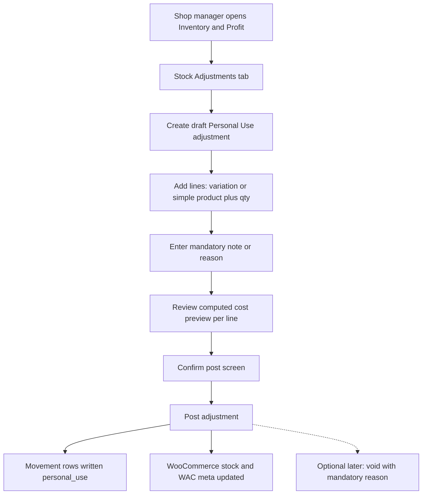

<!-- IMMUTABLE after first commit on feature/m27-personal-use-stock-adjustment.
     Do not edit this file. Implementation follows this specification. -->


# M27 — Manual Stock Movement: Personal Use (Owner Withdrawal)

## 1. Current capability summary

**Repository:** [`/opt/biopentra/dev/wc-inventory-overview`](/opt/biopentra/dev/wc-inventory-overview) (standalone repo, v**1.43.0**, `DB_VERSION` **11**). Roadmap M0–M26 is complete; no M27 exists yet.

### What exists today

| Area | Current state |
|------|---------------|
| **On-hand stock** | WooCommerce `_stock` on simple/variation — plugin treats this as truth for Position “On Hand” |
| **Inventory Position** | Read-only derived `{on_hand, incoming, position}` via [`Inventory_Position_Service`](/opt/biopentra/dev/wc-inventory-overview/includes/class-wc-inventory-overview-inventory-position-service.php); incoming from open PO lines only |
| **Cost model** | **EUR weighted moving average (WAC)** in product meta `_wc_io_average_unit_cost` / `_wc_io_inventory_value` via [`Costing`](/opt/biopentra/dev/wc-inventory-overview/includes/class-wc-inventory-overview-costing.php). **Not FIFO, not lot-based** — receipt/batch line tables store historical snapshots only, never consumed for costing |
| **Inbound stock+cost mutation** | [`Goods_Receipt_Service::post()`/`void()`](/opt/biopentra/dev/wc-inventory-overview/includes/class-wc-inventory-overview-goods-receipt-service.php) → [`Restock_Service::apply_purchase_line_change()`/`apply_purchase_line_reversal()`](/opt/biopentra/dev/wc-inventory-overview/includes/class-wc-inventory-overview-restock-service.php); Quick Restock via [`Restock_Controller`](/opt/biopentra/dev/wc-inventory-overview/includes/class-wc-inventory-overview-restock-controller.php) → `process_purchase_restock()` |
| **Cost-only mutation** | [`Cost_Adjustment_Service`](/opt/biopentra/dev/wc-inventory-overview/includes/class-wc-inventory-overview-cost-adjustment-service.php) — changes average, not stock |
| **Unaudited stock edits** | Inventory Overview inline AJAX ([`ajax_save_inline_stock()`](/opt/biopentra/dev/wc-inventory-overview/includes/class-wc-inventory-overview-overview-controller.php)) — direct `set_stock_quantity()`, optional value resync, **no movement row**, `edit_products` cap |
| **Movement ledger** | [`wc_io_inventory_movements`](/opt/biopentra/dev/wc-inventory-overview/includes/class-wc-inventory-overview-movements.php) — **purchase-side only** in production: `purchase`, `purchase_batch`, `cost_adjustment`, `goods_receipt`, `goods_receipt_void`. Types `sale`, `refund`, `return`, `adjustment` are declared labels only |
| **Customer revenue / COGS** | Order profit uses **frozen order-line snapshots** at configured order status ([`Order_Item_Snapshots`](/opt/biopentra/dev/wc-inventory-overview/includes/class-wc-inventory-overview-order-item-snapshots.php)) — unrelated to movement ledger |
| **REST / CLI** | No REST routes (D16). CLI: `wp wc-io reconcile-qty-received`, `wp wc-io migrate-batches` only |
| **Architecture invariant** | INV-2 / baseline: only **inbound** receipt posting mutates stock+cost through the guarded `Restock_Service` inbound mutators. **No outbound/manual withdrawal path exists** |

### Gap this feature closes

After the first goods receipt, physical consumption (owner personal use) that bypasses WooCommerce orders currently has **no controlled path** that simultaneously: (a) reduces on-hand stock, (b) records inventory cost at WAC, (c) writes audit evidence, and (d) avoids customer-order COGS.

Inline stock edit can reduce quantity but is unaudited, uses `edit_products` (broader than shop-manager), and does not reliably preserve cost evidence unless the optional “auto-update inventory value” setting is on — and even then it never creates a movement row.

**Cost-model verdict: NOT blocked.** Outbound at current WAC is the symmetric operation to inbound WAC math already used on void reversal and inline value sync. No FIFO/lot selection is required or available.

**Scope honesty:** M27 is primarily a **controlled workflow for future personal use**. It does **not** automatically fix already-unrecorded historical consumption. For that gap, M27 ships a **defined operator reconciliation procedure** (§4.1) — not a separate backdating feature and not inline-stock edits.

---

## 2. Recommended scope (M27 v1)

**Ship M27 as a standalone release `v1.44.0`** with:

- **One movement subtype in v1:** `personal_use` only (plus `personal_use_void` for voids)
- **One primary workflow:** draft → review → post → (optional) void
- **Multi-line adjustments** on a single document (same pattern as Goods Receipt — one admin action, multiple products)
- **No generic `adjustment` type** in v1 (stock corrections, write-offs, damage, found stock) — defer to M28+ with explicit reason taxonomy
- **No REST, no CLI** in v1 (no concrete consumer; admin-only, 1–3 users)
- **No inline-stock AJAX changes** in M27 (known G2 defect from [M21 plan §5](/opt/biopentra/dev/wc-inventory-overview/docs/milestones/m21-implementation-plan.md) remains separate backlog)
- **No accounting/VAT postings** — movement ledger + CSV export only (consistent with entire plugin history)
- **No PO / incoming / storefront changes** — outbound reduces on-hand only; Position incoming unchanged

---

## 3. Proposed milestone and branch

| Item | Value |
|------|-------|
| **Milestone** | **M27 — Personal Use Stock Adjustment** (first post-roadmap milestone; supersedes M26’s “do not start M27” note, which referred to a different cancelled initiative) |
| **Feature branch** | `feature/m27-personal-use-stock-adjustment` |
| **Target version** | `1.44.0` (standalone — **Release Trigger:** schema change) |
| **DB version** | `12` |
| **ADR** | New [`docs/adr/0004-outbound-stock-adjustment-ownership.md`](/opt/biopentra/dev/wc-inventory-overview/docs/adr/0004-outbound-stock-adjustment-ownership.md) — ratifies outbound non-sale stock mutation ownership and amends INV-2 prose. **Number verified:** repo ADR index contains `0001`–`0003` only ([`docs/adr/README.md`](/opt/biopentra/dev/wc-inventory-overview/docs/adr/README.md)); `0004` is the next available slot and does not conflict with M26 closure docs (M26 references a cancelled *milestone* M27, not an ADR). |
| **Implementation plan file** | [`docs/milestones/m27-implementation-plan.md`](/opt/biopentra/dev/wc-inventory-overview/docs/milestones/m27-implementation-plan.md) — materialized **after plan approval**, before WP1 |

---

## 4. User workflow — recording personal use



**Step-by-step (admin):**

1. Navigate **WooCommerce → Inventory & Profit → Stock Adjustments** (new tab, `manage_woocommerce` gated).
2. Click **Record personal use** → creates draft adjustment with allocated document number (e.g. `SA-2026-00001`).
3. Add one or more lines via product/variation picker (reuse GR picker rules: exclude variable parents, grouped, external, non-stock-managed — INV-8).
4. Enter quantity to withdraw per line (> 0, ≤ current on-hand at post time).
5. Enter **mandatory note** (e.g. “Owner samples for product photography”).
6. **Preview** shows per line: current on-hand, qty to withdraw, current WAC (EUR), extended cost (= qty × WAC), resulting on-hand and inventory value.
7. **Post** via dedicated confirmation screen + one-shot request token (same idempotency pattern as Goods Receipt post).
8. On success: PRG redirect, adjustment status `posted`, movement rows visible on **Inventory Movements** tab, Overview on-hand/reorder badges reflect new stock on next load.
9. **Void** (if posted in error): mandatory void reason, restores stock+cost using the line’s **immutable posted delta** (§17), writes `personal_use_void` movement rows.

### 4.1 Historical reconciliation procedure (required for already-consumed stock)

M27 posts a **single audited withdrawal** that reduces recorded on-hand from its **current system value** to match physical reality. It does **not** accept a backdated “when consumed” date in v1, and it does **not** replace a prior unrecorded physical reduction if on-hand was already edited down manually.

**Operator procedure (document in admin guide + pre-post UI notice):**

1. **Count physical stock** for each affected item (variation/simple).
2. **Read recorded on-hand** in Inventory Overview (or product editor).
3. **Compute discrepancy:** `qty_to_record = recorded_on_hand − physical_count_remaining`.
4. If `qty_to_record ≤ 0`: **do not post personal use** for that item (either already aligned, or physical exceeds recorded — handle separately in a future correction milestone).
5. If `qty_to_record > 0`: create a personal-use adjustment line with **`qty = qty_to_record`** only. Cost is valued at **current WAC at post time** (the average in the system when you post — not retail price).
6. **Do not** first reduce stock via inline edit / WooCommerce product editor and then post the same quantity through M27 — that **double-reduces**.
7. **Do not** use Quick Restock or Receive Stock for withdrawals (inbound-only paths).

**Example:** Recorded on-hand = 8, physical remaining = 5, unrecorded personal use = 3 → post personal use **qty 3** once. Final on-hand becomes 5 with a movement evidencing cost of `3 × current_WAC`.

This procedure is the **defined reconciliation path** for historical consumption under M27. A dedicated one-time bulk backfill tool remains out of scope (§22).

---

## 5. Movement types — v1 vs future

| Type | M27 v1 | Future |
|------|--------|--------|
| `personal_use` | Yes — outbound withdrawal for owner/operator consumption | — |
| `personal_use_void` | Yes — reversal of a posted personal-use line | — |
| `adjustment` (generic) | **No** — reserved label exists but unused | M28+ stock correction / shrinkage / found stock |
| `sale` / `refund` | No | Separate initiative tied to WooCommerce order lifecycle (D15) |

**Rationale:** `personal_use` has fixed semantics (always outbound, always at WAC, never order-linked). Generic corrections need bidirectional qty, reason codes, and different approval rules — scope creep for v1.

### 5.1 Reporting semantics (`personal_use` vs `personal_use_void`)

Keeping separate movement types (GR precedent: `goods_receipt` / `goods_receipt_void`) is **accepted**, but reporting rules must be explicit:

| Report / export | Rule |
|-----------------|------|
| **Movements list (default)** | Shows both types as separate rows (audit trail) |
| **Movements CSV** | Includes `movement_type` column; operator filters externally for net |
| **Dashboard total inventory value** | Uses live product meta — voids automatically net via restored meta |
| **Future “personal use summary” (not in M27)** | Would use **net** = sum(`personal_use`.total_value) + sum(`personal_use_void`.total_value) — void rows carry opposite-sign values |
| **Must not happen** | Treating void rows as additional permanent outbound usage |

M27 implementation: Movements filter gets **Personal use (posted)** and **Personal use (void)** labels; admin guide documents that **economic outbound = net of both types**. No new aggregate KPI in M27.

---

## 6. Quantity handling and validation

| Rule | Detail |
|------|--------|
| **Sign** | Always positive input qty; service stores negative `quantity_change` on movement row |
| **Max** | `qty ≤ current_on_hand` at post time (fail closed with per-line error, no partial post of multi-line doc) |
| **Min** | `qty > 0` (reject zero/negative/non-numeric — unlike current inline AJAX) |
| **Decimals** | `wc_stock_amount()` / `decimal(19,4)` consistency with rest of plugin |
| **Product eligibility** | Simple or variation only; `managing_stock() === true`; not trash/auto-draft |
| **Multi-line** | Same product allowed on multiple lines? **No** — dedupe by `item_post_id` at save (same as GR line uniqueness expectation) |
| **Max lines per document** | **100** — enforced in **both** `Stock_Adjustment_Service` (reject at save/post with `WP_Error`) **and** admin UI (disable add-line + server-side re-validation). Not presentation-only. Constant: `Stock_Adjustment_Service::MAX_LINES = 100`. |
| **Zero-stock result** | Allowed; when `new_stock === 0`, set average to `0` and inventory value to `0` (matches GR void edge case in [`apply_purchase_line_reversal`](/opt/biopentra/dev/wc-inventory-overview/includes/class-wc-inventory-overview-restock-service.php)) |

---

## 7. Cost valuation rules (explicit)

**Method: current EUR weighted average — not FIFO, not lot-selected.**

There are no consumable cost layers in this plugin. “Which lot” is **not applicable**; cost is always the product’s **current** `_wc_io_average_unit_cost` at post time.

### 7.1 Authoritative read conventions (must match existing code)

Do **not** assume `new_average === old_average` after outbound posting. Rounding and prior meta drift mean the authoritative path is:

**At post time, read state using the same conventions as inbound posting and cost adjustment:**

| Field | Source (binding) |
|-------|------------------|
| `old_stock` | `wc_stock_amount( $product->get_stock_quantity() )` — 0.0 if null |
| `old_avg_raw` / `old_avg` | `Costing::get_average_raw()` / `get_average_float()` |
| `old_inventory_value` | **Prefer** stored `_wc_io_inventory_value` when set (as [`Cost_Adjustment_Service`](/opt/biopentra/dev/wc-inventory-overview/includes/class-wc-inventory-overview-cost-adjustment-service.php) does); **else** `round(old_stock × old_avg, 4)` (as [`apply_purchase_line_change`](/opt/biopentra/dev/wc-inventory-overview/includes/class-wc-inventory-overview-restock-service.php) does when avg exists) |
| `unit_cost` | `old_avg` at post time (snapshotted to line + movement) |
| `value_removed` | `round(qty × unit_cost, 4)` via `wc_format_decimal(..., 4)` |
| `new_stock` | `round(old_stock − qty, 4)` |
| `new_inventory_value` | `max(0, round(old_inventory_value − value_removed, 4))` |
| `new_average` | `new_stock > 0 ? round(new_inventory_value / new_stock, 6) : 0` |

When stored `_wc_io_inventory_value` is consistent with `stock × avg`, `new_average` will equal `old_avg` within rounding tolerance — but implementation **must compute** `new_average` from the formula above, never short-circuit by copying `old_avg`.

**Characterization tests required:** golden fixtures must cover (a) meta value matches `stock × avg`, (b) meta value **drifted** after prior cost adjustment, (c) stock→0 edge, (d) rounding at 4/6 decimal boundaries — verified against **actual** `Restock_Service` output, not hand-calculated assumptions.

### 7.2 Movement row fields

- `quantity_change` = `−qty`
- `unit_cost` = snapshotted average used
- `total_value` = `−value_removed`
- Full before/after stock, average, inventory value columns (same shape as purchase movements)

**Not retail price. Not order snapshot cost. Not supplier PO price.**

**Interaction with order profit:** None — no WooCommerce order is created or modified; `_wc_io_*_snapshot` order meta untouched.

**Dashboard KPIs:** Total inventory value meta sum ([`Costing::get_total_inventory_value_meta_sum()`](/opt/biopentra/dev/wc-inventory-overview/includes/class-wc-inventory-overview-costing.php)) decreases by sum of withdrawn values — expected.

---

## 8. Behaviour when historical cost data is unavailable

| Condition | M27 behaviour |
|-----------|---------------|
| **`_wc_io_average_unit_cost` unset/null** | **Block posting** with clear error: “No inventory cost on record — receive stock or set cost before recording personal use.” Operator path: Quick Restock / Goods Receipt / Cost Adjustment first. |
| **Average is 0 and `allow_zero_supplier_cost` setting is off** | Block (consistent with inbound [`Restock_Service`](/opt/biopentra/dev/wc-inventory-overview/includes/class-wc-inventory-overview-restock-service.php) inbound guard) |
| **Average is 0 and setting allows zero cost** | Allow with explicit UI warning; movement records `unit_cost = 0`, `total_value = 0` — stock reduces, cost evidence shows zero (operator accepts accounting limitation) |
| **Stock qty null/unset** | Block — same as cost adjustment |

**No invented/backfilled costs.** The plugin never guesses a unit cost from retail price or PO history at post time.

---

## 9. Database / schema changes (`DB_VERSION` 12)

New tables (mirroring Goods Receipt shape, simplified — no landed costs, no PO linkage):

**`{prefix}wc_io_stock_adjustments`** (header)

- `id`, `adjustment_number` (unique, `SA-YYYY-NNNNN` via new `Stock_Adjustment_Numbering`)
- `adjustment_kind` varchar — M27 always `'personal_use'` (column enables M28 kinds without migration)
- `status` — `draft` / `posted` / `voided`
- `note` text (mandatory before post)
- `void_reason` text nullable
- `created_at`, `updated_at`, `posted_at`, `voided_at`, `posted_by`, `voided_by`

**`{prefix}wc_io_stock_adjustment_lines`**

- `id`, `adjustment_id`, `product_id`, `variation_id`
- `qty` decimal(19,4)
- `sku_snapshot`, `name_snapshot` (immutable at post, GR precedent)
- Posted snapshots: `unit_cost_at_post`, `value_removed`, `old_stock`, `new_stock`, `old_average_unit_cost`, `new_average_unit_cost`, `old_inventory_value`, `new_inventory_value`

**No changes** to `wc_io_inventory_movements` columns — reuse existing `reference_type = 'stock_adjustment'`, `reference_id = adjustment header id`.

**Install:** extend [`WC_Inventory_Overview_Install`](/opt/biopentra/dev/wc-inventory-overview/includes/class-wc-inventory-overview-install.php) with `expected_schema_v12()` shape guard.

---

## 10. Audit requirements

- **Movement ledger:** one `personal_use` row per posted line; one `personal_use_void` row per voided line — append-only, never edited/deleted
- **Document immutability:** posted lines’ snapshot columns frozen; header gains `posted_at`/`posted_by`
- **Void audit:** mandatory `void_reason`, `voided_at`/`voided_by`; status CAS `posted → voided`
- **No separate event table** (GR precedent — movement + header timestamps sufficient for M27)
- **Movements admin tab:** add filter label for `personal_use` / `personal_use_void`; CSV export includes new types
- **Reference drill-down:** movement list links to adjustment detail (read-only posted/voided view)

---

## 11. Permissions and capabilities

Extend [`Purchasing_Caps`](/opt/biopentra/dev/wc-inventory-overview/includes/class-wc-inventory-overview-purchasing-caps.php) (filterable map, default `manage_woocommerce`):

| Action key | Gates |
|------------|-------|
| `VIEW_STOCK_ADJUSTMENT` | List/detail read |
| `EDIT_STOCK_ADJUSTMENT` | Draft create/edit/delete |
| `POST_STOCK_ADJUSTMENT` | Post |
| `VOID_STOCK_ADJUSTMENT` | Void posted |

**Security order:** capability → nonce → request token (post/void) — same as [`Goods_Receipt_Admin`](/opt/biopentra/dev/wc-inventory-overview/includes/class-wc-inventory-overview-goods-receipt-admin.php).

**Stricter than inline stock (`edit_products`):** personal use requires shop-manager-level access by default.

---

## 12. Admin UI

| Surface | Change |
|---------|--------|
| **New hub tab** | Inventory & Profit → **Stock Adjustments** (`TAB_STOCK_ADJUSTMENTS`) |
| **New controller** | `WC_Inventory_Overview_Stock_Adjustment_Controller` + `Stock_Adjustment_Admin` (follow M20 decomposition — HTTP glue separate from service) |
| **Subviews** | List drafts/posted/voided; New/Edit draft; Post confirmation; Read-only posted/voided detail |
| **Assets** | New JS for line add/remove + cost preview AJAX (`wp_ajax_wc_io_stock_adjustment_preview`) |
| **Overview integration (read-only)** | Optional link on row actions: “Record personal use” → prefill new draft with that item (GET navigation only, no mutation — M22 prefill pattern) |
| **Restock tab** | Add cross-link notice: “To withdraw stock for personal use with cost tracking, use Stock Adjustments.” |

**Internal vs UI vocabulary (D18):** classes `Stock_Adjustment*`; UI strings “Personal use” / “Record personal use” / “Void personal use”.

---

## 13. REST / CLI

| Interface | M27 |
|-----------|-----|
| **REST** | **Out of scope** (D16 — no consumer) |
| **CLI** | **Out of scope** — admin workflow sufficient for 1–3 users; defer `wp wc-io stock-adjustment` until bulk backfill need proven |
| **Hooks** | Optional internal action `wc_io_stock_adjustment_posted` / `wc_io_stock_adjustment_voided` for future accounting export — document as Internal, not Public API |

---

## 14. Interaction with POs, incoming, storefront

| System | Effect |
|--------|--------|
| **Purchase orders** | None — no PO lines touched, no PO events |
| **Incoming / Position** | On-hand decreases; incoming unchanged; Position = on_hand + incoming recalculates on read |
| **Expected delivery / storefront** | Only indirect: if on-hand hits 0, existing availability/expected-delivery logic may activate — no new storefront code |
| **Reorder signal (M21)** | Reflects new on-hand on next page load — may flip `needs_reorder` / `covered_by_incoming` |
| **Goods receipts / Quick Restock** | Unchanged — remain inbound-only |

---

## 15. WooCommerce stock update path

**All mutations go through a new sole outbound orchestrator:**

`Stock_Adjustment_Service::post()` / `void()` → `Restock_Service::apply_outbound_line_change()` / `apply_outbound_line_reversal()`

- Controllers/admin-post/AJAX **never** call `WC_Product::set_stock_quantity()` directly for this workflow
- Update architecture guard in [`test-goods-receipt-architecture.php`](/opt/biopentra/dev/wc-inventory-overview/tests/unit/goods-receipt/test-goods-receipt-architecture.php) → rename/extend to stock-mutation architecture test: inbound mutators caller-set unchanged; outbound mutators callable only from `Stock_Adjustment_Service`

**Inline stock edit remains a separate, unaudited path** — not removed in M27.

### 15.1 Transaction vs compensation (binding — do not overclaim SQL rollback)

**Critical honesty:** [`DB_Transaction`](/opt/biopentra/dev/wc-inventory-overview/includes/class-wc-inventory-overview-db-transaction.php) wraps **custom-table writes** (adjustment header/lines status, movement inserts). **WooCommerce product meta/stock saves are not transactional with MariaDB** — they commit via `$product->save()` independently. M27 follows the **same compensating-snapshot pattern** as Quick Restock and Goods Receipt (not naive “SQL rollback restores WC meta”).

**Per-line post ordering (inside `Stock_Adjustment_Service::post()` transaction closure):**

1. Validate all lines (qty, cost, caps) — **no WC writes yet**
2. For each line in deterministic order (ascending `item_post_id`):
   - a. `apply_outbound_line_change()` → WC meta save; capture `snapshot` + movement payload
   - b. `Movements::insert_personal_use()` — if fail → `restore_snapshot()` for **this line only**, then throw (abort remaining lines)
3. Compare-and-swap adjustment header `draft → posted`; persist line snapshots
4. Transaction commits

**On any throw after line N partially applied:** closure rolls back **custom-table writes only**; service **must** iterate all snapshots collected this request and call `restore_snapshot()` in reverse order (same as GR multi-line post failure path).

**Void ordering:** mirror GR void — per line `apply_outbound_line_reversal()` then movement insert; failure → restore that line’s snapshot.

**Failure-mode acceptance tests (required):**

| Scenario | Expected |
|----------|----------|
| WC save succeeds, movement insert fails | Line snapshot restored; no movement row; header stays `draft`; retry safe |
| Line 1 succeeds, line 2 WC save fails | Line 1 restored; header stays `draft`; no partial posted state |
| Lines 1–N applied, header CAS fails | All N lines restored; header stays `draft` |
| Compensation (`restore_snapshot`) throws | Return `WP_Error` with code `wc_io_compensation_failed`; log product id; operator must reconcile manually (document in rollback plan) |
| Retry after failed post | Idempotent token consumed on first attempt; operator gets fresh draft token; no duplicate movement |

**Do not claim** that `DB_Transaction::run()` alone prevents partial WC meta mutation — tests must prove compensating restore behaviour.

---

## 16. Idempotency and concurrency

| Concern | Approach |
|---------|----------|
| **Double-submit post/void** | [`PO_Request_Token`](/opt/biopentra/dev/wc-inventory-overview/includes/class-wc-inventory-overview-po-request-token.php) contexts `sa_post`, `sa_void` + header status compare-and-swap |
| **Concurrent posts on same product** | No advisory locks (unlike M25). Last writer wins bounded by `qty ≤ on_hand` check at post — second post fails if first already reduced stock below requested qty. Residual TOCTOU window documented (same honesty as [M25 plan](/opt/biopentra/dev/wc-inventory-overview/docs/milestones/m25-implementation-plan.md)) |
| **Concurrent with GR post / Quick Restock / inline edit** | Same TOCTOU — post-time stock read is authoritative; insufficient stock → clean rollback |
| **Idempotent void** | Second void attempt on `voided` header → no-op error, no double restoration |

---

## 17. Reversal / correction behaviour

### 17.1 Void semantics (binding)

Void uses **current-state-relative restoration of the line’s immutable posted delta** — the outbound symmetric of [`apply_purchase_line_reversal`](/opt/biopentra/dev/wc-inventory-overview/includes/class-wc-inventory-overview-restock-service.php) / GR void:

**Chosen rule (coherent WAC):** void **adds back** the line’s stored `qty` and `value_removed` to **current** stock and inventory value, then **recalculates** `new_average = new_value / new_stock` (or 0 if stock becomes 0). It does **not** force the pre-withdrawal average to return unchanged if intervening inbound receipts changed the cost base.

Per-line void math (`apply_outbound_line_reversal()`):

```
current_stock, current_avg, current_value  ← read now (§7.1 conventions)
restored_stock  = current_stock + line.qty
restored_value  = current_value + line.value_removed   // value_removed always positive on line
new_average     = restored_stock > 0 ? round(restored_value / restored_stock, 6) : 0
```

Movement row: type `personal_use_void`, `quantity_change = +line.qty`, `total_value = +line.value_removed`, `unit_cost = line.unit_cost_at_post`.

**Required characterization scenario (three-step):**

1. Post personal use (withdraw qty at WAC₁)
2. Post goods receipt (add stock at different WAC₂ — changes average)
3. Void personal use → assert stock/value/average match hand-computed restored state, **not** a naive “undo to pre-step-1 snapshot”

Void fails closed if `restored_stock` would be inconsistent (defensive; unlikely for void of outbound).

### 17.2 Other correction paths

| Scenario | Mechanism |
|----------|-----------|
| **Posted in error (same day)** | **Void** entire adjustment — per §17.1 |
| **Partial mistake on multi-line doc** | M27: void entire document, create new draft — **no partial void** in v1 (GR parity) |
| **Wrong qty discovered later** | Void + re-post; no retroactive edit of posted documents |
| **Generic stock correction (count variance)** | Out of scope — future `adjustment` kind in M28 |
| **Historical consumption already reflected in wrong on-hand** | Use §4.1 reconciliation — not void |

---

## 18. VAT / accounting boundaries

- **In scope:** EUR movement-ledger evidence exportable via existing Movements CSV; document number, user, timestamp, note, qty, unit cost, total value
- **Out of scope:** VAT lines, general-ledger accounts, double-entry postings, tax reports — plugin has never generated these; M27 does not start
- **Owner withdrawal accounting:** Operator uses movement export as supporting evidence for inventory draw / private consumption in their external accounting — plugin records economic cost at WAC, not retail value

---

## 19. Migration and backward compatibility

- **No data migration** — greenfield tables
- **Existing stock/cost meta** untouched on upgrade
- **Existing movement rows** untouched
- **Inline stock / WC native stock edits** continue to work; documented as inappropriate for cost-tracked withdrawals
- **Plugin upgrade path:** `dbDelta` on activate; `assert_schema_shape()` for v12
- **Rollback:** [`docs/rollback-plan.md`](/opt/biopentra/dev/wc-inventory-overview/docs/rollback-plan.md) add M27 section — code rollback does not undo posted adjustments; void before rollback or manual reconcile (GR precedent)

---

## 20. Test strategy and acceptance criteria

Follow [milestone lifecycle WP0–WP6](/opt/biopentra/dev/wc-inventory-overview/docs/process/milestone-lifecycle.md): characterization-first, architecture guards, integration tests.

**New test suites:**

- `tests/unit/stock-adjustment/test-stock-adjustment-architecture.php` — sole mutator, cap order, no controller→Restock direct calls, `MAX_LINES` enforced in service
- `tests/integration/stock-adjustment/test-outbound-costing-characterization.php` — golden WAC outbound math: meta-consistent vs drifted `_wc_io_inventory_value`, stock→0, rounding boundaries (assert against actual service output)
- `tests/integration/stock-adjustment/test-stock-adjustment-service-post-void.php` — happy path, insufficient stock, **failure-mode matrix (§15.1)**, idempotent token, **three-step void-after-receipt scenario (§17.1)**
- `tests/integration/stock-adjustment/test-stock-adjustment-admin-characterization.php` — admin-post, preview AJAX, PRG notices, 101st line rejected in UI and service
- `tests/integration/movements/test-movements-characterization.php` — extend for new types, reference drill-down, **net-reporting documentation fixture**

**Acceptance criteria (operator-visible):**

1. Can record personal use for a variation with known WAC; on-hand decreases by qty; inventory value decreases per §7.1 (not assumed `old_avg` copy)
2. Movement row appears with type “Personal use”, negative qty, correct EUR value, note, user, link to adjustment
3. Cannot post qty > on-hand — clear error, no partial state
4. Cannot post when average cost missing — clear error with remediation hint
5. Void after intervening goods receipt at different cost recalculates WAC per §17.1; writes void movement; cannot void twice
6. Order profit reports unchanged (no new orders)
7. PO incoming/Position incoming unchanged after personal use
8. Double post submit is idempotent
9. **Failure tests:** movement insert failure leaves WC meta restored; multi-line partial failure restores all touched lines
10. **Historical reconciliation:** operator can follow §4.1 (documented in admin guide) to record discrepancy qty without double-reducing
11. All pre-existing tests green; PHPCS/release-audit `--development` clean

---

## 21. Versioning and release implications

| Item | Value |
|------|-------|
| Plugin version | `1.44.0` |
| DB_VERSION | `12` |
| Release type | **Standalone** (schema trigger — do not bundle silently) |
| Artifacts | `CHANGELOG.md`, `docs/GITHUB_RELEASE_NOTES_1.44.0.md`, `docs/checklists/m27-release-readiness.md`, CLAUDE.md status table row |
| Dev deploy | Bind-mounted plugin on dev.biopentra.eu — activate/migrate after merge |
| ADR | `0004-outbound-stock-adjustment-ownership.md` committed with implementation |

---

## 22. Risks and explicitly excluded scope

**Risks**

| Risk | Mitigation |
|------|------------|
| Double-reduction if on-hand already wrong | §4.1 reconciliation procedure in admin guide + pre-post UI notice; do not claim M27 auto-fixes silent past edits |
| TOCTOU concurrent stock changes | Post-time validation + transaction rollback; document residual window |
| Operators bypass workflow via inline stock | Cross-link + future inline-stock hardening milestone (old M21 G2) |
| INV-2 documentation drift | ADR-0004 + architecture guard update |

**Explicitly excluded from M27**

- Generic stock corrections / `adjustment` movement type
- Sale/refund/return ledger integration with WooCommerce orders
- FIFO / lot / batch-layer consumption
- REST / Store API / CLI
- Partial void; edit posted documents
- Backdated `occurred_at` (deferred to M28; use §4.1 for historical gap)
- Inline stock AJAX hardening or removal
- Accounting/VAT integration
- MPCF / fulfillment integration
- Bulk personal-use import / one-time historical backfill CLI
- Mobile/barcode scanning

---

## 23. Implementation work packages (WP-M27)

| WP | Deliverable |
|----|-------------|
| WP-M27-0 | Materialize approved plan; ADR-0004 draft |
| WP-M27-1 | Schema v12 + repositories + numbering |
| WP-M27-2 | `Restock_Service` outbound mutators + golden costing tests |
| WP-M27-3 | `Stock_Adjustment_Service` post/void + movements + transactions |
| WP-M27-4 | Admin UI (tab, list, draft edit, preview AJAX, post confirm, void) |
| WP-M27-5 | Movements tab labels/filter + Overview prefill link + **admin guide §4.1 reconciliation** |
| WP-M27-6 | Architecture guards + full integration suite + release docs |

---

## 24. Product decisions (locked)

| # | Decision | Resolution |
|---|----------|------------|
| 1 | Backdating (`occurred_at`) | **Deferred** — `posted_at` only in v1; historical gap handled via §4.1 reconciliation qty |
| 2 | Zero-cost withdrawals | **Permitted with explicit UI warning** when `allow_zero_supplier_cost` setting is on |
| 3 | Overview prefill link | **Included** — “Record personal use” GET prefill (M22 pattern) |
| 4 | Maximum lines per document | **100** — enforced in service **and** UI |

---

## 25. Smallest safe next step

**Plan approved with review corrections incorporated.** Next step: **materialize** [`docs/milestones/m27-implementation-plan.md`](/opt/biopentra/dev/wc-inventory-overview/docs/milestones/m27-implementation-plan.md) (full spec including §4.1, §7.1, §15.1, §17.1) and draft **ADR-0004** on branch `feature/m27-personal-use-stock-adjustment` before any production code (WP-M27-0).

**Immediate operator action (no code, can start today):** For each item with unrecorded personal use, perform a physical count and compute `qty_to_record = recorded_on_hand − physical_remaining` per §4.1. Hold posting until M27 ships — do **not** inline-edit stock down in the meantime.
